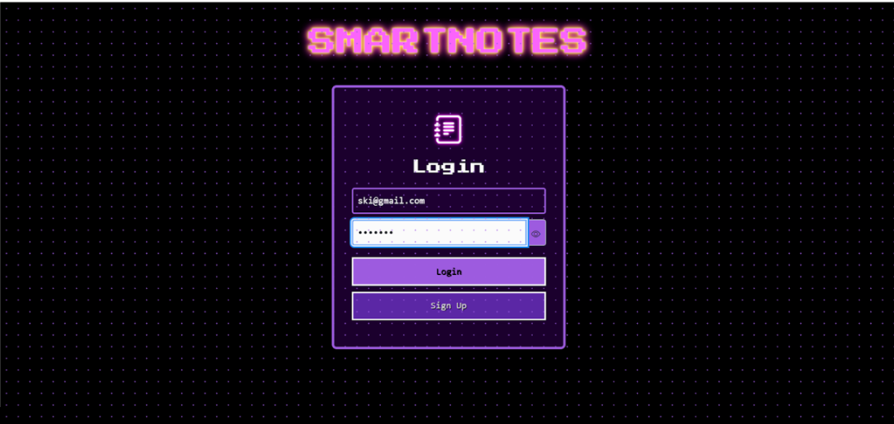
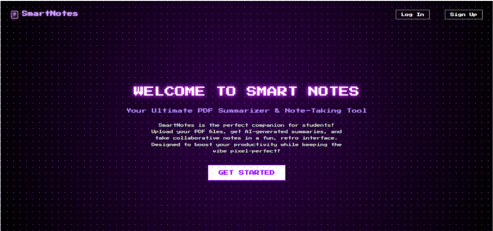
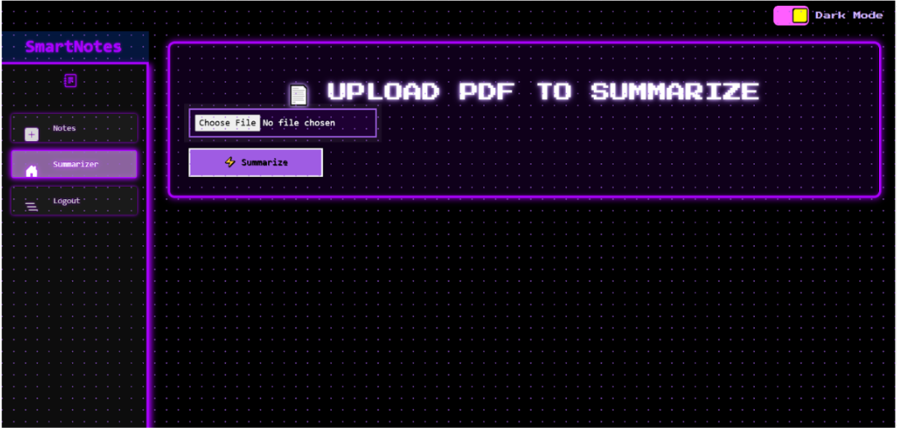

# SMART NOTES — AI POWERED STUDY ASSISTANT
---
## DOCUMENTATION PREVIEW

<p align="center">
  
  
  
  <br>
  <em>📘 A glimpse of Smart Notes in action — pixel-perfect and student-powered!</em>
</p>

---

## DEVELOPER

**👾 Player 1:** Drixyl Reece Irish G. Nacu  
📍 *University of San Carlos – Talamban Campus*  
🎓 *Bachelor of Science in Computer Science*

**Tech Stack:** ASP.NET Core | Blazor | OpenRouter API | GitHub Actions

---

## PROBLEM STATEMENT (WHY)

Students spend too much time manually summarizing PDFs and organizing notes. Existing tools lack **collaboration**, personalization, and a **fun studying experience**. The goal was to **automate note creation** while keeping users in control and motivated.

---

## GOALS & SUCCESS METRICS (WHAT)

* Reduce study preparation time by **50%**
* Generate structured notes in **<10 seconds**
* Support **real-time collaboration**
* Provide a **fun, pixel-art-themed studying experience**
* Build a **modular, production-ready system**

---

## IDEATION & PRODUCT THINKING (HOW IT STARTED)

* Mapped the workflow: **PDF upload → text extraction → AI summarization → editing → storage**
* Evaluated **manual vs automated steps** to minimize friction
* Designed a **pixel-art UI** to make studying feel like a retro game

**Artifacts:**

* Flow diagrams
* Prompt drafts
* Feature lists

---

## SYSTEM ARCHITECTURE

**Architecture:**

```
Frontend (Blazor)
   ↓
API Layer (ASP.NET Core)
   ↓
LLM Service (OpenRouter API)
   ↓
Database / Storage
```

**Components:**

* PDF Parser Service
* AI Summarizer Module
* Collaboration Engine (Etherpad)
* Storage Layer

**Design Principles:**

* Modular
* Scalable
* Testable
* Replaceable AI provider

---

## AI ENGINEERING APPROACH

**Prompt Strategy:**

* System prompt defines assistant role
* User prompt provides context
* Output format constraints applied

**Techniques:**

* Prompt chaining
* Output validation
* Retry logic
* Token optimization

**Tools:** ChatGPT, Claude, Cursor, OpenRouter API

---

## DEVELOPMENT PROCESS

**Workflow:**

* Prototype with **Lovable**
* Refine with **Cursor**
* Implement backend services
* Write unit tests
* Review with AI
* Push to GitHub

**Branch Strategy:**

* `main`
* `feature/*`
* `hotfix/*`

**Code Quality:**

* Linting
* Refactoring
* Documentation

---

## CI/CD & DEPLOYMENT

**Pipeline:**

* On GitHub push → Build → Test → Lint → Deploy

**Tools:** GitHub Actions, Environment secrets

**Sample Workflow:**

* On PR → run tests
* On `main` → auto-deploy

**Monitoring:** Logs, Error tracking, Performance checks

---

## CHALLENGES & HOW I SOLVED THEM

| Challenge              | Solution                                            |
| ---------------------- | --------------------------------------------------- |
| Inconsistent AI output | Added strict formatting rules and output validators |
| Slow response          | Cached summaries                                    |
| API failures           | Retry logic + fallback prompts                      |
| Auth issues            | JWT refresh workflow implemented                    |

---

## RESULTS & IMPACT

* Improved summarization **consistency by ~35%**
* **Real-time collaboration** fully functional
* **Pixel-art UI** increased engagement for testing group

---

## LESSONS & IMPROVEMENTS

**What I Learned:**

* Importance of **prompt design**
* Reliability of **CI/CD pipelines**
* Managing **API costs**

**Next Steps:**

* Add **vector search for notes**
* Improve **UI/UX**
* Build **mobile version**

---

## TECH STACK

| Frontend | Backend | Other Tools |
|-------------|-----------|---------------|
|  |  |  |
|  |  |  |
|  |  |  |

---


